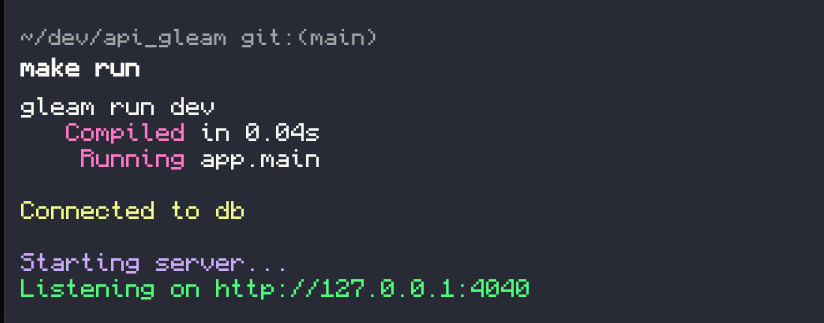

# Gleam API


## Prerequisites

- Docker
- Gleam
- make

## Running application

1. Run docker compose
```sh
docker-compose up # --build
```

## Development

1. Setup the databas
```sh
make db_up
```

2. Run migration
```sh
make migrate_up
```

3. Run the project
```sh
make run
```

## Api

### Ping server

#### Request
`GET /api/v1/ping`

### Register a user

#### Request
`POST /api/v1/auth/register`

#### Request body
```json
{
  "username": "string",
  "password": "string",
  "email": "string"
}
```

### Login a user

#### Request
`POST /api/v1/auth/login`

#### Request body
```json
{
  "email": "string",
  "password": "string"
}
```

### Get current user

#### Request
`GET /api/v1/auth/status`

### Logout a user

#### Request
`POST /api/v1/auth/logout`